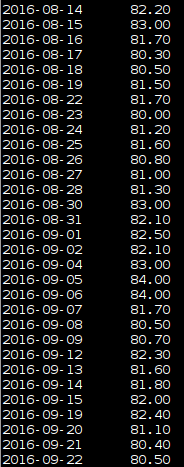
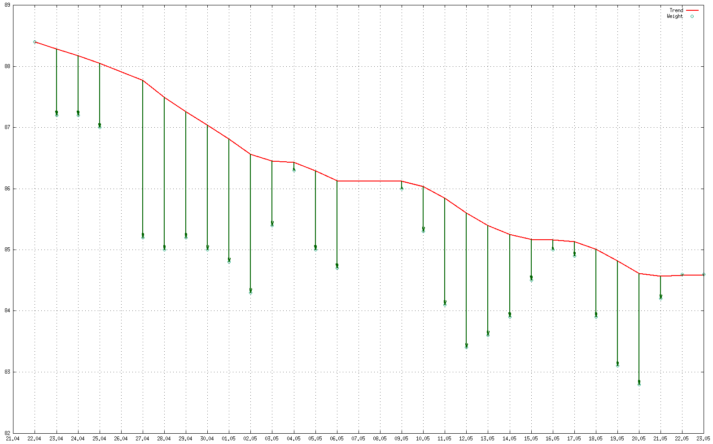

hdiet
========

hdiet is an adaptation of the Hacker's Diet computer tools.

The Hacker's Diet
=================

"The Hacker's Diet" is an ingenious [book](https://www.fourmilab.ch/hackdiet/) by John Walker which applies a systems and signals view to bodyweight. If you haven't already, go read it.

Walker provides excellent online tools for tracking and Excel-/Palm-based tools for offline tracking. I'm not comfortable with either, though, and as it [turns out](https://www.fourmilab.ch/hackdiet/e4/pencilpaper.html), the calculations needed for trend calculation are simple. hdiet consists of a few bash and python scripts to track, process and display.

Dependencies
============

* Bash
* gnuplot-x11
* Python 3
* GNU date

Makeup
======

* import - imports a Hacker's Diet CSV export
* log - appends today's value to the tracking file
* process - calculates the trend
* show - display the curves using gnuplot-x11, takes either no arguments or FROM and TO in format YYYY-MM-DD
* dietcalc - calculate a diet curve for certain goals, also gets displayed with 'show'

Weights are logged as plain text, each line consisting of YYYY-MM-DD\tWEIGHT.
The log file is always processed as a whole again, because it keeps the
program simple and even a file with data from 100 years only takes 180ms to
process and display on my machine.

Example
=======

Example of a filled weight log:

Example of a trend graph with the floaters and sinkers.

